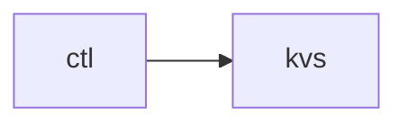

# Task 1 - Single-node key-value store (KVS)

In this task you will implement a single-node key-value store (KVS) 
using [RocksDB](http://rocksdb.org/docs/getting-started.html).

## Architecture of the single-node key-value store

The implementation of the single-node key-value store consists of two
executables, the controller (`ctl`) and the server / node which hosts the
actual key-value store (`kvs`).

To perform a GET request, a message is sent from the controller to the KVS:



## Controller

The controller submits GET, PUT and DELETE requests to the API port of the
key-value server. The code for the controller is provided in the source
directory (`src/clt.cc`). You should not need to modify the code.

The controller can be run like this:

```
./ctl put mykey myvalue
./ctl get mykey
./ctl del mykey
```

## Server

The server receives the messages from the controller and should reply to
requests appropriately. The code for the server is provided in the source 
directory (`src/kvs.cc`).

The server can be run like this:

```
./kvs
```

## Tasks

Your task is to implement the key-value server. The server should be able to
handle multiple requests in parallel and efficiently. The server listens for
incoming connections and executes the requests by applying them to its local KV
store. For every executed request, the server needs to reply back to the
client. You should use `google::protobufs` for serializing the
messages/requests over the network. We have provided you with the `.proto`
files that describe the request and the response message format.

Additionally, the server needs to manage an instance of RocksDB, a
well-established database. All incoming requests **must** be executed on
RocksDB.

Finally, you are requested to implement a simple multithreaded-capable client.
The client should receive as arguments:
1. the server IP and the port it is listening to (-s)
2. the number of client threads to generate (-c)
3. the number of messages to send (-m)

The client should spawn the appropriate number of threads and send PUT requests
to the KV server. The key values should be the range [0, messages). 
The keys should be distributed equally among the client threads.
The value for each of the key should be its numerical value (e.g., key=42, value=42).
An example execution of you the requested client is the following:
```
client -s 127.0.0.1:31000 -c 4 -m 80000
```

## Core repository structure
1. [`include/cloudlab/kvs.hh`](include/cloudlab/kvs.hh): Complete the given KVS class constructor where you have to simply open the DB.
2. [`lib/kvs.cc`](lib/kvs.cc): Implement the required functionalities to manage the DB instance.
3. [`lib/handler/p2p.cc`](lib/handler/p2p.cc): Implement the PUT,GET and DELETE message handlers.
4. [`lib/network/connection.cc`](lib/network/connection.cc): Class that represents a network connection.	
   For this part, you have to implement the following:
   1. Create a socket connection with the provided SocketAddress object.
   Mind that it is recommended to use the flag `SO_REUSEADDR` to allow the kernel to rebind an address even when in `TIME_WAIT` state.
   2. De-serialize the message (receive)
   3. Serialize the message (send)
5. [`lib/network/server.cc`](lib/network/server.cc): Implemented (TCP) network server class.
6. [`lib/network/address.cc`](lib/network/address.cc): Implemented SocketAddress class for the Representation of an IPv4 / IPv6 address and a port.
7. [`src/clt.cc`](src/clt.cc): Example application that sends a single request to the server as described [above](##Controller).
8. [`src/argh.hh`](src/argh.hh): Helper for parsing arguments (source: https://github.com/adishavit/argh)
9. [`src/my_client.cc`](src/my_client.cc): Implement a multithreaded client as explained in the [tasks](##Tasks)
10. [`lib/message/cloud.proto`](lib/message/cloud.proto): Protobuf file containing the message format. Its compilation is integrated in the `CMakeLists.txt`.
    You can observe the create files to identify the message types. Some of them are already used in [`lib/handler/api.cc`](lib/handler/api.cc). 
11. [`test`](test/): the `test` folder contains the [tests based on the google test framework](test/unit_tests/) validating the correct KVS and Connection functionality and some additional [python tests](test/process_tests/) to examine the correct behaviour of the KVS over the network.
12. [`include/cloudlab/flags.hh`](include/cloudlab/flags.hh): includes a flag that can be used to enable/disable debugging prints.

**Note**: The functionalities that you should implement are tagged with `// TODO(you)` in the code skeleton.

## Build instructions

1. Install all required packages:

   ```
   sudo apt-get install build-essential cmake libgtest-dev librocksdb-dev libprotobuf-dev protobuf-compiler libpthread-stubs0-dev zlib1g-dev libevent-dev
   ```

2. Build the source code using the provided [`CMakeLists.txt`](CMakeLists.txt):

   ```
   mkdir build && cd build/ && cmake .. && make
   ```

**Note**: The tests expect to find the executables in the `build` directory.

## CI Environment

For the rare occassion that bugs are experienced in the CI but not
locally or you want to avoid package version problems and get a pre-configured 
environment, it is also possible to run the github action environment locally
with [docker](https://www.docker.com/) using this [container
image](https://github.com/orgs/ls1-courses/packages/container/package/ls1-runner):

``` console
# This will mount your current directory as /code into the container
docker run -ti --entrypoint=/bin/bash -v $(pwd):/code --rm ghcr.io/ls1-courses/ls1-runner:latest
```

**Note**: To test your own client-server architecture, you probably will need the option `--network host`, unless you want to mess with docker networking options.

## Tests

### Test 1.0 - Correctness with one client thread

This test checks the correctness of your implementation for single-threaded
server. Various GET, PUT and DELETE requests are performed and verified.

To execute the test independently, run:
```
build/task1 --gtest_filter='Task1.Correctness'
```

### Test 1.1 - Correctness with multiple client threads

This test checks the correctness of your implementation for multi-threaded
server and client processes. Various GET, PUT and DELETE requests are performed and verified.

To execute the test independently, run:
```
build/task1 --gtest_filter='Task1.Multithreaded'
```

### Test 1.2 - Correct implementation of Connections

This test checks the correctness of your implementation for the connections. 
GET, PUT and DELETE messages are exchanged and verified.

To execute the test independently, run:
```
build/task1 --gtest_filter='Task1.ConnectionTest'
```

### Test 1.3 - Correctness with one client thread using the network stack

This test checks the correctness of your implementation for a single-threaded
client-server setup using the network stack. 
Various PUT requests are performed and verified through a verifier process
that checks the existence of all inserted keys and values.

To execute the test independently, run:
```
python test/process_tests/test_single.py
```

### Test 1.4 - Correctness with multiple client threads using the network stack

This test checks the correctness of your implementation for a multi-threaded
client-server setup using the network stack. 
Various PUT requests are performed and verified through a verifier process
that checks the existence of all inserted keys and values.

To execute the test independently, run:
```
python test/process_tests/test_multi.py
```

## References

* [Protobufs](https://developers.google.com/protocol-buffers/docs/cpptutorial)
* [RocksDB](http://rocksdb.org/docs/getting-started.html)

